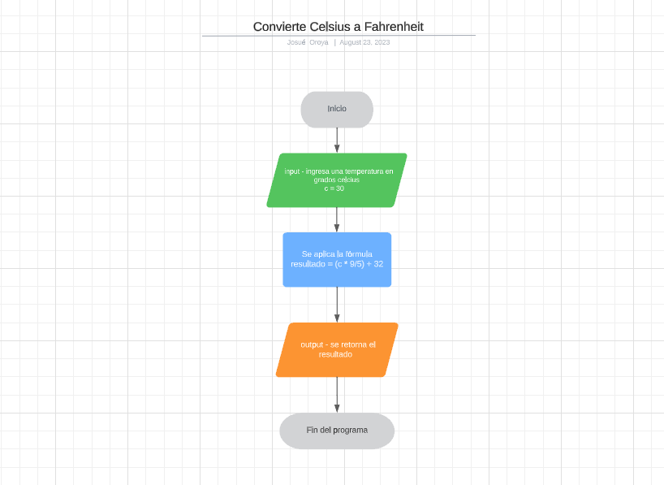

# Aplicación del pensamiento lógico y diagramas de flujo para resolver un problema

Hemos llegado a un punto en el que ya sabemos cómo funciona un programa, cómo se ejecuta y cómo se escribe. Ahora, vamos a aprender a resolver problemas de manera lógica y estructurada.

## Breve repaso

Antes de continuar, repasaremos algunos conceptos clave

### ¿Qué es un algoritmo?

Un algoritmo es un conjunto de instrucciones que se ejecutan para resolver un problema. Es una serie de pasos que se deben seguir para llegar a un resultado.

### ¿Qué es el pensamiento computacional?

El pensamiento computacional es la habilidad que tenemos los seres humanos para resolver problemas de manera lógica y estructurada. Es la manera en la que pensamos para resolver un problema.

### ¿Cómo aplicar el pensamiento computacional?

Para aplicar el pensamiento computacional, debemos seguir los siguientes pasos:

1. Definir el problema
2. Analizar el problema
3. Identificar las entradas
4. Identificar las salidas
5. Identificar el proceso
6. Diseñar el algoritmo
7. Codificar el algoritmo
8. Probar el algoritmo
9. Documentar el algoritmo
10. Mejorar el algoritmo

### ¿Qué es un diagrama de flujo?

Un diagrama de flujo es una representación gráfica de un algoritmo. Es una manera de representar los pasos que se deben seguir para resolver un problema.

## Planteo del problema

Vamos a resolver el siguiente problema: **Convierte Celsius a Fahrenheit**

### Definir el problema

El problema consiste en convertir una temperatura en grados Celsius a grados Fahrenheit.

### Analizar el problema

Para resolver el problema, debemos conocer la fórmula para convertir grados Celsius a grados Fahrenheit:

```
F = (C * 9/5) + 32
```

La fórmula para convertir de Celsius a Fahrenheit es la temperatura en Celsius multiplicado por 9/5, más 32.

### Identificar las entradas

Las entradas son los datos que necesitamos para resolver el problema. En este caso, necesitamos la temperatura en grados Celsius.

Se te da una variable celsius que representa una temperatura en Celsius.

### Identificar las salidas

Las salidas son los resultados que esperamos obtener al resolver el problema. En este caso, necesitamos la temperatura en grados Fahrenheit.

### Identificar el proceso

Utilizaremos la variable fahrenheit ya definida y le asígnaremos la temperatura Fahrenheit equivalente a la temperatura Celsius dada. Utiliza la fórmula mencionada anteriormente para ayudarte a convertir la temperatura Celsius a Fahrenheit.

### Diseñar el algoritmo

Plantearemos el algoritmo usando un diagrama de flujo. Para ello, utilizaremos los siguientes símbolos:




### Codificar el algoritmo

Una vez que tenemos el diagrama de flujo, podemos codificar el algoritmo en el lenguaje de programación que estemos utilizando.

```javascript
const celsius = 20;

const fahrenheit = (celsius * 9/5) + 32;

console.log(fahrenheit);
```

### Probar el algoritmo

Para probar el algoritmo, podemos ejecutar el programa y verificar que el resultado sea el esperado.

### Documentar el algoritmo

Para documentar el algoritmo, podemos agregar comentarios al código para explicar qué hace cada línea.

```javascript
// Definimos la variable celsius
const celsius = 20;

// Definimos la variable fahrenheit y le asignamos el valor de la temperatura en Fahrenheit
const fahrenheit = (celsius * 9/5) + 32;

// Mostramos el resultado por consola
console.log(fahrenheit);
```

### Mejorar el algoritmo

Para mejorar el algoritmo, podemos crear una función que reciba la temperatura en Celsius y devuelva la temperatura en Fahrenheit.

```javascript
// Definimos la función convertirACelsius
const convertirACelsius = (celsius) => {
  // Definimos la variable fahrenheit y le asignamos el valor de la temperatura en Fahrenheit
  const fahrenheit = (celsius * 9/5) + 32;

  // Devolvemos la temperatura en Fahrenheit
  return fahrenheit;
}

// Definimos la variable celsius

const celsius = 20;

// Mostramos el resultado por consola
console.log(convertirACelsius(celsius));
```

En este caso, la función recibe la temperatura en Celsius y devuelve la temperatura en Fahrenheit. De esta manera, podemos reutilizar la función en cualquier parte del programa.

## Conclusión

En este artículo, aprendimos a resolver problemas de manera lógica y estructurada. Para ello, utilizamos el pensamiento computacional y diagramas de flujo.


